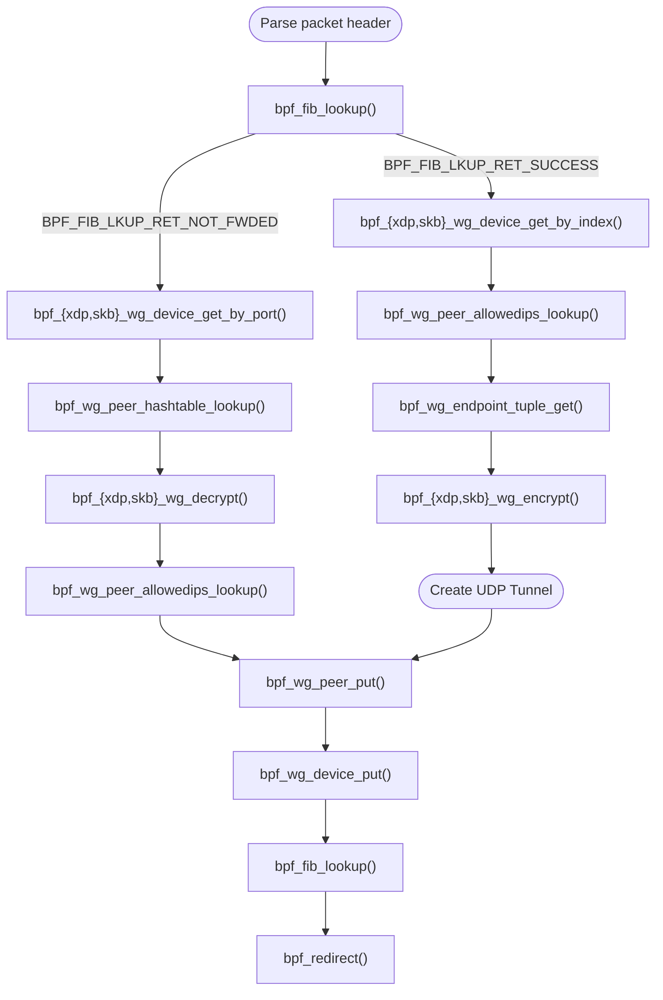

# WireGuard Kernel API for eBPF

This repository contains eBPF kfuncs to interact with the eBPF kernel module and an example eBPF XDP and TC program that uses them to encrypt and decrypt WireGuard packets.

<br>

## eBPF Kernel API (kfuncs)

The following kfuncs provide access to WireGuard device and peer references, as well as encryption/decryption helpers inside eBPF programs.

The eBPF verifier will reject the program if the eBPF program attempts to dereference or doesn't release an acquired reference before exiting the program. The ```__sz``` and ```__ksz``` suffixes inside the parameter names are used as memory/size annotations for the verifier.

---

### WireGuard Device Functions

#### `struct wg_device *bpf_xdp_wg_device_get_by_index(struct xdp_md *ctx, u32 ifindex)`<br>`struct wg_device *bpf_skb_wg_device_get_by_index(struct __sk_buff *ctx, u32 ifindex)`

- **Parameters:**
  - `ctx`: XDP/TC program context
  - `ifindex`: Network interface index
- **Returns:** Pointer to a `wg_device` or `NULL` if not found.
- **Description:**  
  Acquire a reference to the WireGuard device bound to the given interface index.  
  Must be released before the program exits with [`bpf_wg_device_put`](#void-bpf_wg_device_putstruct-wg_device-wg).

#### `struct wg_device *bpf_skb_wg_device_get_by_port(struct xdp_md *ctx, u16 port)`<br>`struct wg_device *bpf_skb_wg_device_get_by_port(struct __sk_buff *ctx, u16 port)`

- **Parameters:**
  - `ctx`: XDP/TC program context
  - `port`: UDP port
- **Returns:** Pointer to a `wg_device` or `NULL` if not found.
- **Description:**  
  Acquire a reference to the WireGuard device bound to the given UDP port.  
  Must be released later with [`bpf_wg_device_put`](#void-bpf_wg_device_putstruct-wg_device-wg).

---

### Peer Lookup Functions

#### `struct wg_peer *bpf_wg_peer_allowedips_lookup(struct wg_device *wg, const void *addr, u32 addr__sz)`
- **Parameters:**
  - `wg`: WireGuard device reference
  - `addr`: IPv4/IPv6 address pointer
  - `addr__sz`: Size of the address (4 for IPv4, 16 for IPv6)
- **Returns:** Pointer to a `wg_peer` or `NULL` if not found.
- **Description:**  
  Look up a WireGuard peer from the plaintext source IP address.
  Must be released before the program exits with [`bpf_wg_peer_put`](#void-bpf_wg_peer_putstruct-wg_peer-peer).

#### `struct wg_peer *bpf_wg_peer_hashtable_lookup(struct wg_device *wg, __le32 idx)`
- **Parameters:**
  - `wg`: WireGuard device reference
  - `idx`: Receiver index (from encrypted packet header)
- **Returns:** Pointer to a `wg_peer` or `NULL` if not found.
- **Description:**  
  Look up a WireGuard peer from the receiver index of an incoming encrypted packet.
  Must be released before the program exits with [`bpf_wg_peer_put`](#void-bpf_wg_peer_putstruct-wg_peer-peer).

---

### Endpoint Functions

#### `int bpf_wg_endpoint_tuple_get(struct wg_peer *peer, struct bpf_sock_tuple *tuple, u32 tuple__ksz)`
- **Parameters:**
  - `peer`: WireGuard peer reference
  - `tuple`: Output buffer for socket tuple (IP + port)
  - `tuple__ksz`: Size of `tuple`
- **Returns:** `0` on success, negative error code otherwise.
- **Description:**  
  Retrieve the UDP endpoint information (source/destination IP and port) used by the peer.

---

### Encryption/Decryption

#### `int bpf_xdp_wg_encrypt(struct xdp_md *ctx, u32 offset, u32 length, struct wg_peer *peer)`<br>`int bpf_skb_wg_encrypt(struct __sk_buff *ctx, u32 offset, u32 length, struct wg_peer *peer)`
- **Parameters:**
  - `ctx`: XDP/TC program context
  - `offset`: Plaintext data offset
  - `length`: Data length
  - `peer`: WireGuard peer reference
- **Returns:** `0` on success, negative error code otherwise.
- **Description:**  
  Encrypts data in the packet starting at `offset` with length `length`, using the peer’s sending key.  
  Pushes a WireGuard header and increments the peer’s sending counter.  

#### `int bpf_xdp_wg_decrypt(struct xdp_md *ctx, u32 offset, u32 length, struct wg_peer *peer)`<br>`int bpf_skb_wg_decrypt(struct __sk_buff *ctx, u32 offset, u32 length, struct wg_peer *peer)`
- **Parameters:**
  - `ctx`: XDP/TC program context
  - `offset`: WireGuard header offset
  - `length`: Data length
  - `peer`: WireGuard peer reference
- **Returns:** `0` on success, negative error code otherwise.
- **Description:**  
  Decrypts data in the packet starting at `offset` with length `length`, using the peer’s receiving key.  
  Validates and updates the peer’s receive counter.

---

### Reference Management

#### `void bpf_wg_device_put(struct wg_device *wg)`
- Release a previously acquired WireGuard device reference.

#### `void bpf_wg_peer_put(struct wg_peer *peer)`
- Release a previously acquired WireGuard peer reference.

<br>

## Example eBPF program

The following flow chart shows how the eBPF program uses the Kernel API/kfuncs to encrypt or decrypt incoming packets:



<br>

### Compiling

To compile the program, switch to the ```src/``` directory and execute ```make```. This will generate a little endian ```wg_le.o``` and big endian ```wg_be.o``` eBPF object inside the ```obj/``` directory.

```
$ cd src/
$ make
clang -O2 -g -Wall -target bpf -std=gnu23 -mlittle-endian -c wg.c -o obj/wg_le.o
clang -O2 -g -Wall -target bpf -std=gnu23 -mbig-endian -c wg.c -o obj/wg_be.o
```

<br>

## Running

To attach the eBPF/XDP program to a network interface, you can use the ```ip``` command line tool:

```
$ ip link set <ifname> xdp obj wg_*e.o program xdp_wg
```

<br>

To attach the eBPF/TC program to a network interface, you can use the ```tc``` command line tool:
```
$ tc qdisc add dev <ifname> clsact
$ tc filter add dev <ifname> ingress bpf da obj wg_*e.o program tc_wg
```
